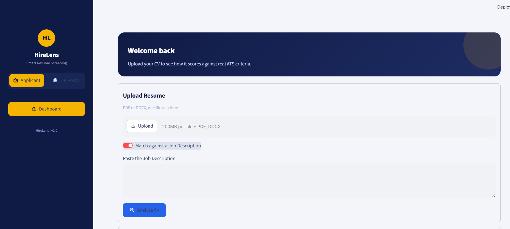
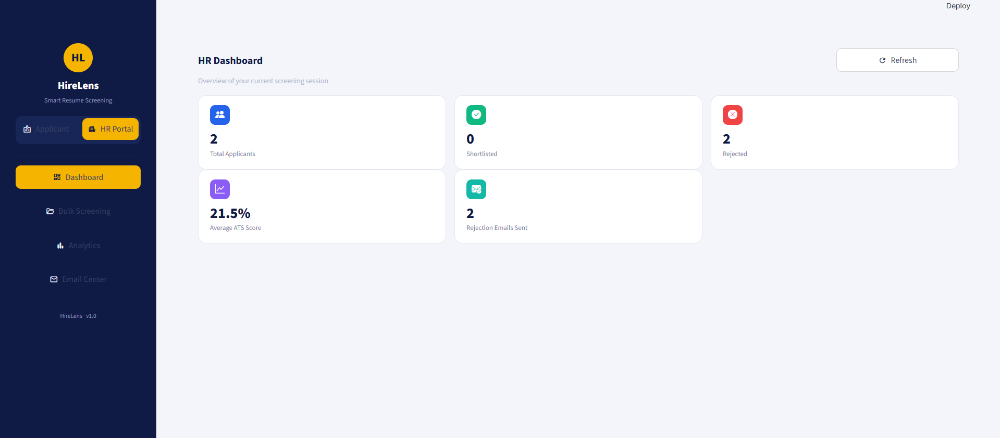
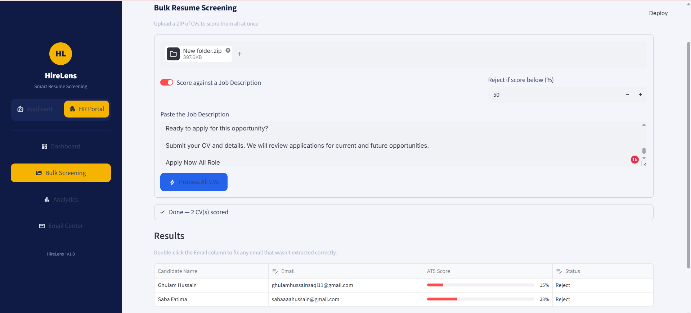
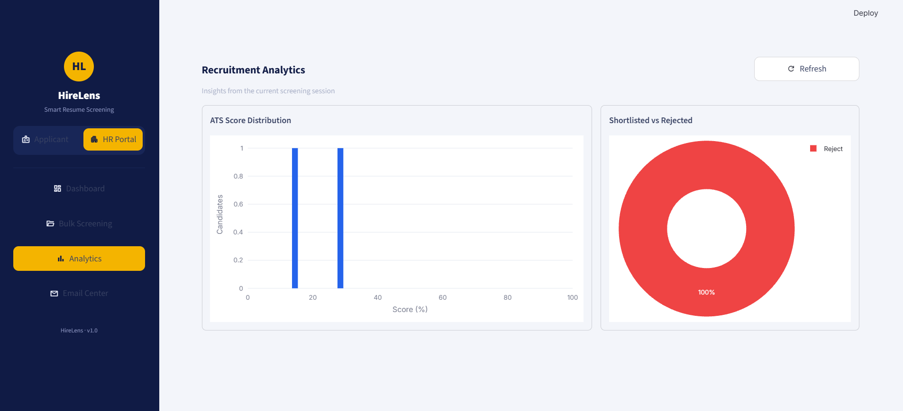
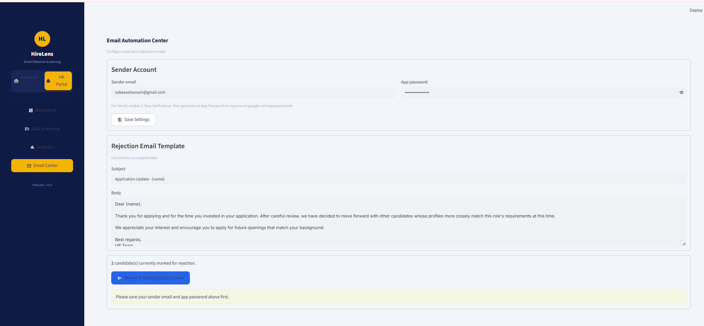

<div align="center">


</div>

---

## 🎯 Overview

**ATS CV Checker** is a browser-based resume screening platform built with **Streamlit**. It has two portals: an **Applicant Portal** where anyone can upload their CV and instantly see how it scores against real ATS criteria, and an **HR Portal** where recruiters can bulk-screen an entire ZIP folder of candidate CVs, review results in an editable table, visualize the screening session with charts, and send rejection emails automatically — only after explicit review and confirmation.

---

## 🎬 App Preview

<div align="center">

| 🏠 Applicant Dashboard | 📊 HR Dashboard | 📁 Bulk Screening |
|:---:|:---:|:---:|
|  |  |  |

| 📈 Analytics | ✉️ Email Center |
|:---:|:---:|
|  |  |

</div>

---

## ✨ Features

<table>
<tr>
<td width="50%" valign="top">

### 🙋 Applicant Portal
- 📤 Upload a CV (PDF / DOCX)
- 🎯 Match against a pasted Job Description
- 🩺 Or run a general CV health check (no JD needed)
- ⭕ Circular ATS score gauge with a full breakdown
- 🕘 Session history of every resume checked

</td>
<td width="50%" valign="top">

### 🧑‍💼 HR Portal
- 📁 Bulk-upload a ZIP of candidate CVs
- ⚖️ Auto Pass / Reject against a configurable threshold
- ✏️ Editable results table (fix emails, override status)
- 📈 Score distribution + Shortlisted vs Rejected charts
- ✉️ Rejection email automation — review-then-send only

</td>
</tr>
</table>

---

<div align="center">

</div>

## 🛠️ Tech Stack

<div align="center">

</div>

| Layer | Technology |
|---|---|
| Language | Python 3.10+ |
| Web Framework | Streamlit (native multipage `st.navigation`) |
| Charts | Plotly (score gauge, histogram, pie chart) |
| Data Tables | Pandas + `st.data_editor` |
| PDF Parsing | `pdfplumber` |
| DOCX Parsing | `python-docx` |
| Email | `smtplib` (Gmail App Password / any SMTP) |

---

## 🚀 Getting Started

**1. Clone the repo**
```bash
git clone https://github.com/Sabafatima9/ATS-CV-Checker-Web.git
cd ATS-CV-Checker-Web
```

**2. Install dependencies**
```bash
pip install -r requirements.txt
```

**3. Run the app**
```bash
streamlit run app.py
```

> **Tip:** the app opens automatically in your browser at `http://localhost:8501`. Use the sidebar to switch between the Applicant Portal and HR Portal.

---

## ☁️ Deploying to Streamlit Community Cloud

```bash
git add .
git commit -m "Deploy ATS CV Checker Web"
git push -u origin main
```

Then on [share.streamlit.io](https://share.streamlit.io): **Create app → From existing repo** → select this repo → main file path `app.py` → **Deploy**.

> ⚠️ `settings.json` (sender email + app password) is git-ignored on purpose. Set these directly in the deployed app's **Email Center**, or move them into Streamlit **Secrets** for a more secure setup.

---

## 🏗️ Project Structure

```
ATS_CV_Checker_Web/
├── app.py                          # 🎮 Entry point — sidebar + page router
├── sidebar.py                      # Navy/gold sidebar (native buttons, no iframe)
├── theme.py                        # Color palette + score_color helper
├── styles.py                       # Injected CSS for the enterprise look
├── state_helpers.py                # st.session_state initialization
├── components.py                   # KPI cards, badges, Plotly score gauge
├── cv_parser.py                    # PDF/DOCX text, email, name extraction
├── ats_scorer.py                   # Scoring logic (JD-match + general health)
├── email_sender.py                 # SMTP sending via smtplib
├── settings_manager.py             # Loads/saves sender email + app password
├── pages_app/
│   ├── applicant_dashboard.py      # Applicant Portal
│   ├── hr_dashboard.py             # HR KPI dashboard
│   ├── hr_bulk_screening.py        # ZIP upload + editable results table
│   ├── hr_analytics.py             # Plotly charts
│   └── hr_email_center.py          # Settings, template, review & send
├── .streamlit/config.toml          # Streamlit theme (matches the palette)
├── requirements.txt                # Dependencies
└── README.md                       # 📖 You're here
```

> Generated resume scores and candidate lists live in `st.session_state` for the duration of the browser session — no database required.

---

## 🧠 How It Works

| Concept | Implementation |
|---|---|
| **JD Match Scoring** | Extracts the most frequent meaningful keywords from the pasted Job Description, checks overlap with the CV text, scores as a % match |
| **General Health Scoring** | Checklist across Skills / Experience / Education / Contact / Summary sections, resume length, action verbs, and layout cleanliness |
| **Bulk Screening** | `zipfile` extracts every PDF/DOCX from the uploaded ZIP, each is parsed and scored, then flagged Pass/Reject against the threshold |
| **Email Automation** | `smtplib` logs into the HR's Gmail (via App Password) and sends a personalized `{name}` templated email to every Rejected candidate, only after confirmation in a modal dialog |

---

## 📈 Roadmap

- [ ] OCR support for scanned/image-only PDFs
- [ ] Persistent database instead of session-only storage
- [ ] Export HR screening results as a PDF/Excel report
- [ ] Multi-language resume support
- [ ] Interview scheduling integration
- [ ] Streamlit Secrets support out-of-the-box for deployed instances

---

<div align="center">

### ⭐ Star this repo if HireLens made your screening workflow easier!


</div>
